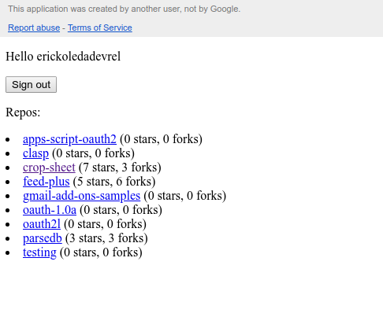

# Sample Web App

Note: This is the README file for the original app. This version
was adapted for CptS 489.  --CH

This sample web application connects to your GitHub account using the Apps
Script OAuth2 library and displays some information about the repositories you
own. It demonstrates some best practices for using this library in a web app.



## Setup

You can easily setup your own copy of this sample using the
[`clasp`](https://github.com/google/clasp) command line tool. Install it and
run `clasp login` before executing the commands below.

1.  Run the following commands in this directory:
    ```sh
    clasp create "Sample Web App"
    clasp push
    clasp open
    ```
1.  In the opened script editor, run the function `logRedirectUri`. Open the
    logs (**View > Logs**) and copy the URL shown.
1.  Open the [GitHub Developer console](https://github.com/settings/developers)
    and create a new OAuth App. Paste the URL you copied above into the field
    **Authorization callback URL**.
1.  Edit the file `Code.gs` and uncomment the lines defining the variables
    `CLIENT_ID` and `CLIENT_SECRET`. Paste the corresponding values from the
    GitHub developer console into those variables.
1.  Run the following commands:
    ```sh
    clasp deploy
    ```
1.  Copy the deployment ID from the command line and insert it into the
    following URL: `https://script.google.com/macros/s/<DEPLOYMENT_ID>/exec`.
    Open that URL in your browser.

## Intercom.js

This web app uses the [intercom.js library](https://github.com/diy/intercom.js/)
to communicate between tabs / windows. Specifically, the callback page sends a
message to the web app letting it know when the authorization flow has
completed, so it can start updating its contents.

## Angular

This web app uses the [Angular 1 framework](https://angularjs.org/) to make it
easier to update the page dynamically. It's use is not required, and many
other JavaScript frameworks would work just as well.
